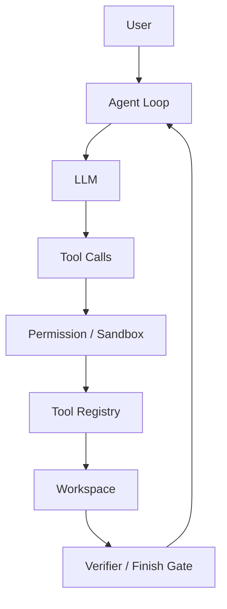

# mini-agent-lab

[](https://github.com/GimMoliyadi/mini-agent/actions/workflows/ci.yml)

**A controlled tool-use coding agent runtime built from scratch.**

Built directly on the SDK to expose and test tool dispatch, approvals, and
completion rules rather than delegate those decisions to LangChain.

An OpenAI-compatible model searches a trusted workspace, makes bounded edits,
runs allowlisted tests and requests verified completion. Explicit controls
cover approvals, paths, sessions, context, Coding Contracts and recovery.

> **Run:** `pip install -e .` then `mini-agent config` and `mini-agent start`.
> **Eval:** 36 scripted tasks × 2: 56 accepted and 16 expected rejections.
> Runtime regression evidence; live model quality remains unmeasured. Report:
> [`benchmark/reports/benchmark-v1.md`](benchmark/reports/benchmark-v1.md).
> **Limit:** the file sandbox and command policy do not provide OS-level
> isolation; live model quality still requires separate review.

## Overview

A single-user local agent with a directly implemented Agent Loop, one Tool
Registry and explicit execution boundaries. v1.0 focuses on engineering
hardening and portfolio readiness, preserving the existing runtime behavior.

## Why this project

The project exists to make the control boundary visible. LangChain or a
similar framework can shorten the first prototype, but it would hide the
decisions this repository is meant to demonstrate: how tool calls are paired
with results, how paths and commands are authorized, how a session resumes,
how a test is proved fresh after a mutation, and how an independent verifier
rejects an unsafe or incomplete result. The runtime uses the OpenAI-compatible
SDK directly and keeps the registry, loop, and acceptance rules in the
repository.

## Architecture



The runtime is split into small modules under [`mini_agent/`](mini_agent/):
`runtime.py` owns orchestration, `agent.py` owns the model-facing loop,
`tools/registry.py` is the single tool registry, `sandbox.py` and
`permissions.py` enforce execution boundaries, `session.py` persists explicit
sessions, `verifier.py` checks the final artifact, and `trace.py` records
optional in-memory or JSONL events. The old top-level imports remain
compatibility shims while callers migrate to the package.

## Core capabilities

- Native OpenAI-compatible tool calling with legal assistant/tool message
  pairing and bounded model turns.
- File listing, literal search, bounded reads, exact patches, writes, and
  renames under a normalized workspace path boundary.
- Command execution with `shell=False`, an allowlist, workspace-limited `cwd`,
  timeout and output caps, and a minimal child-process environment.
- Explicit `ASK`, `ALLOW`, and `DENY` approval modes with fail-fast behavior
  when an interactive approval channel is unavailable.
- Coding Contracts that protect required tests and allowed mutation paths;
  `finish_task` is accepted only after a fresh required-test pass.
- Session resume, bounded context, recovery after a limit or interruption,
  and an independent final Verifier.
- Structured internal tool results while preserving the existing text tool
  message protocol for the model.
- Optional JSONL trace output with redacted argument summaries, statuses,
  durations, usage, approvals, mutations, and verifier outcomes.

## Quick Start

Requires Python 3.11 or newer. From a clean checkout:

```powershell
py -3.11 -m venv .venv
.\.venv\Scripts\python.exe -m pip install -e .
.\.venv\Scripts\mini-agent.exe config
.\.venv\Scripts\mini-agent.exe start
```

On Linux or macOS:

```sh
python3.11 -m venv .venv
.venv/bin/python -m pip install -e .
.venv/bin/mini-agent config
.venv/bin/mini-agent start
```

`config` stores the API address, model name, and key in local private state;
`start` opens the interactive loop. For a one-shot JSON task, use:

```powershell
.\.venv\Scripts\mini-agent.exe task --task "Fix the pricing calculation and run its test" --workspace C:\path\to\trusted-project
```

The offline diagnostics command does not call a model:

```powershell
.\.venv\Scripts\mini-agent.exe doctor --workspace C:\path\to\trusted-project
```

The compatibility launchers `mini.cmd` and `agent.cmd` remain available on
Windows, but the installed `mini-agent` entry point is the standard interface.

## Example workflow

The two-minute, provider-free demo uses the existing scripted Agent Loop on a
temporary fixture:

```powershell
.\.venv\Scripts\python.exe examples\offline_coding_demo.py
```

It traces this complete path:

```text
user goal → search/read → first patch → required test fails
           → recovery patch → required test passes → finish gate
           → independent verifier accepts
```

The demo uses no API key and writes only a redacted example trace at
[`examples/example_trace.jsonl`](examples/example_trace.jsonl). The reusable
offline regression suite is [`benchmark/`](benchmark/README.md):

```powershell
python benchmark/run_benchmark.py --repetitions 2 --output benchmark/reports/benchmark-v1.json
```

## Evaluation

Benchmark v1 contains 36 tasks covering repository navigation, file search,
precise and multi-file edits, test failure and repair, long files, wrong paths,
permission rejection, illegal modifications, incomplete work, finish gates,
duplicate calls, and recovery. It uses six fixture defects plus navigation
and policy schedules; these are
36 runtime regression tasks, not 36 independent real-world coding problems.
The two-repetition [report](benchmark/reports/benchmark-v1.md)
has 72 deterministic scripted rows:

| Metric | Result |
| --- | ---: |
| Acceptance Rate | 0.7778 |
| Positive Acceptance Rate | 1.0 |
| Median Model Calls | 6 |
| Median Tool Calls | 6 |
| Median Tokens | `null` (scripted usage unavailable) |
| P95 Tokens | `null` (scripted usage unavailable) |
| Max-step Rate | 0.2222 |
| Unexpected Modification Rate | 0.0556 |
| Runtime Error Rate | 0.0 |

These numbers are runtime regression evidence from scripted replies, not live
model success rates. Acceptance includes intentional negative controls; the
positive rate excludes those expected rejections. Token values are local
accounting estimates shown only as a separate diagnostic field in the report;
the published token metrics remain `null` when scripted provider usage is
unknown. Tasks marked for manual review remain separate from the deterministic
oracle, and no machine rule is treated as semantic quality of 100%. Historical provider observations live under
[`docs/evaluation/`](docs/evaluation/README.md) and are not merged into this
table.

The 16 expected rejection rows account for every max-step result. The four
unexpected-modification rows deliberately change protected test files; none
of the 56 positive rows modifies an unapproved path. Semantic review remains
pending separately.

## Security model

Three boundaries have different meanings:

1. **Workspace path sandbox** normalizes paths and prevents file tools from
   escaping the configured workspace. It also filters sensitive directories
   and protects snapshots used by the verifier.
2. **Command policy** accepts only specific command forms, passes argument
   arrays with `shell=False`, restricts `cwd`, applies time and output caps,
   and gives subprocesses a minimal environment. It is a policy boundary,
   not a shell replacement.
3. **OS-level process isolation** is outside the current runtime. The file
   sandbox and command policy do **not** equal an operating-system sandbox:
   project code still runs with the current user's privileges and may access
   resources that the policy does not model. Use a disposable trusted
   workspace and a separate OS/container boundary for untrusted code.

Regression tests cover path traversal, environment leakage, dangerous Git
   arguments, approvals, command limits, session identity, and verifier scope.
   Secrets and complete private file contents are excluded from traces; a
   workspace file read by the model can still be sent to the configured model
   provider, as described in [`SECURITY.md`](SECURITY.md).

## Limitations

- The runtime is designed for a trusted local project, not arbitrary hostile
  code execution. There is no default OS sandbox or Docker backend in v1.0.
- Live model quality, semantic correctness, and provider cost are not inferred
  from the offline benchmark. Use the benchmark for deterministic regression,
  then record live runs with their provider failures and manual review.
- A model may still choose an inefficient tool sequence or stop at the turn
  budget. The finish gate and verifier make that failure explicit; they do not
  make an arbitrary model reliable.
- Sessions and journals can contain conversation and file history. Keep the
  state directory private and do not place secrets in the workspace.
- CI is configured for Windows and Linux on Python 3.11 and 3.13;
  unusual filesystem permissions, untrusted repositories, and provider-specific
  tool-call quirks need separate validation.

## Project structure

```text
mini_agent/              runtime package
  agent.py               model loop and reply protocol
  runtime.py             CLI task orchestration
  config.py              limits and configuration
  context.py             bounded context view
  session.py             explicit session persistence
  permissions.py         approval policy
  sandbox.py             workspace path boundary
  recovery.py            bounded recovery state
  verifier.py            contract and finish verification
  trace.py               optional in-memory / JSONL trace
  tools/                 single tool registry and handlers
tests/                   offline regression tests
benchmark/               Benchmark v1 manifest, harness, metrics, report
examples/                one-minute offline coding-loop demo
docs/                    history, evaluation, and experiment archive
```

## Roadmap

v1.0 closes the existing runtime boundary: preserve behavior, keep the old
tests green, make the package installable, publish CI, document the threat
model, and provide a repeatable benchmark. New abstractions or dependencies
belong in a later proposal only when a concrete current limitation justifies
them. RAG, Memory, multi-agent orchestration, Planner, Reflection, and broad
feature expansion are outside this release.

The Phase 1–25 development record is preserved in
[`docs/development-history/`](docs/development-history/README.md), with the
detailed handoff in [`docs/HANDOFF_TO_CODEX.md`](docs/HANDOFF_TO_CODEX.md).

## License

See [`LICENSE`](LICENSE).
