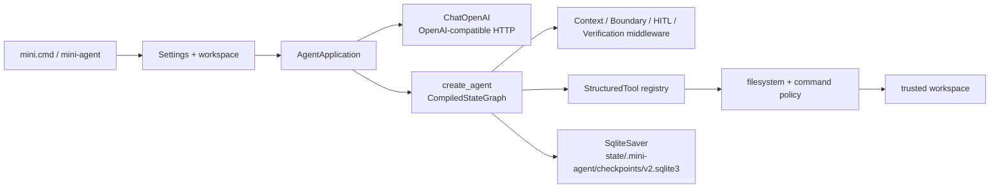

# mini-agent-lab

一个面向受信任本地项目的受控 coding agent。v2 使用 LangChain 的
`create_agent` 组装标准工具循环，使用 LangGraph 保存会话状态、处理中断和
恢复；文件安全、命令白名单、审批策略和任务验收仍由本项目负责。

当前公开入口是同步的 Windows/package CLI。传输测试使用本地、脚本化的
OpenAI-compatible HTTP 服务验证了模型请求、工具调用、文件修改、错误返回和
SQLite 恢复。真实模型也已完成一次文件与代码维护验收：5 次模型调用、9 次工具
调用，指定测试与独立验收通过；完整证据和复现步骤见 [迁移与验证记录](docs/migration.md)。

## 安装与配置

需要 Python 3.11 或更高版本。Windows 从源码目录运行：

```powershell
py -3.11 -m venv .venv
.\.venv\Scripts\python.exe -m pip install -c requirements.lock -e ".[dev]"
.\mini.cmd config
```

`config` 交互式写入 `OPENAI_BASE_URL`、`OPENAI_MODEL` 和
`OPENAI_API_KEY`。配置文件位于状态目录的 `.env`，不会写入模型请求参数，也不
应提交到 Git。状态目录由 `MINI_AGENT_STATE_DIR` 决定；源码 checkout 默认使用
项目目录以保持现有 `.env` 约定，安装后的默认位置是用户目录下的
`.mini-agent`。需要切换位置时，在运行命令前设置变量：

```powershell
$env:MINI_AGENT_STATE_DIR = "$HOME\.mini-agent"
.\mini.cmd config
```

也可以直接使用安装后的入口：

```powershell
.\.venv\Scripts\mini-agent.exe config
```

Linux/macOS 使用等价的 `python3.11 -m venv .venv`、`.venv/bin/pip` 和
`.venv/bin/mini-agent`。模型配置仍使用同名环境变量；`OPENAI_BASE_URL` 必须
指向兼容 Chat Completions 的服务地址。

## 常用命令

选择工作目录后启动交互式会话：

```powershell
.\mini.cmd start --workspace C:\path\to\trusted-project
```

一次性任务以一行 JSON 输出结果，适合脚本和 Web UI：

```powershell
.\mini.cmd task `
  --task "修复计算逻辑并运行测试" `
  --workspace C:\path\to\trusted-project
```

JSON 结果包含 `session_id`、`task_id`、`status`、`answer`、`interrupts`、
`pending_nodes`、`trace` 和 `error`。副作用工具处于 `ASK` 审批模式时，命令会
返回 `status: "interrupted"` 和完整的审批动作；批准或拒绝使用同一个会话：

```powershell
.\mini.cmd task --resume SESSION_ID --approve --workspace C:\path\to\trusted-project
.\mini.cmd task --resume SESSION_ID --reject  --workspace C:\path\to\trusted-project
```

`--approve` 和 `--reject` 只处理当前 checkpoint 中的待审批动作，恢复时仍会
重新校验工作区和工具前置条件。`ALLOW` 适用于已信任的临时项目，`DENY` 会拒绝
副作用工具；默认 `ASK` 不会静默放宽审批。

Coding Contract 通过 JSON 文件限定允许修改的相对路径和验收测试：

```json
{
  "task_id": "fix-calculator",
  "instruction": "修复 calculator.py 的加法错误",
  "allowed_paths": ["calculator.py"],
  "test_command": {"command": "python", "args": ["-m", "pytest", "-q"], "cwd": "."},
  "require_test_pass": true
}
```

运行 contract：

```powershell
.\mini.cmd task --contract C:\path\to\contract.json --workspace C:\path\to\trusted-project
```

`doctor --workspace PATH` 只检查本地路径和配置存在性，不访问模型；`sessions`
读取 SQLite checkpoint，`sessions --legacy` 只列出历史 JSON 文件；`version` 返回
包版本。Windows 下 `agent.cmd` 仍是调用 `mini.cmd start` 的兼容包装器。

## v2 架构


```mermaid
flowchart LR
    CLI[mini.cmd / mini-agent] --> Settings[Settings + workspace]
    Settings --> App[AgentApplication]
    App --> Model[ChatOpenAI<br/>OpenAI-compatible HTTP]
    App --> Graph[create_agent<br/>CompiledStateGraph]
    Graph --> MW[Context / Boundary / HITL / Verification middleware]
    Graph --> Tools[StructuredTool registry]
    Tools --> FS[filesystem + command policy]
    FS --> Work[trusted workspace]
    Graph --> SQLite[SqliteSaver<br/>state/.mini-agent/checkpoints/v2.sqlite3]
```

应用装配发生在 `mini_agent.runtime.AgentApplication`：它读取
`mini_agent.settings.Settings`，调用 `mini_agent.models.create_model`，通过
`mini_agent.tools.registry.build_tools` 得到唯一的模型可见工具集合，再把模型、
工具、middleware 和 `SqliteSaver` 交给 `langchain.agents.create_agent`。完整模块
职责、状态字段和扩展边界见 [`docs/architecture.md`](docs/architecture.md)。

工具适配层使用 LangChain `StructuredTool` 和 Pydantic 参数模型。工作区以绑定
参数注入 handler，不出现在模型 schema 中；工具返回
`content_and_artifact`，其中 `ToolResult` 的状态、错误码和元数据留在
`ToolMessage.artifact`。`risk`、`mutation`、`workspace_arguments` 和
`mutation_paths` 由 `BoundaryMiddleware` 用于审批、contract 路径检查和前置条件
校验。

## 实时进度事件（同步 LangGraph streaming）

运行 `mini-agent task --task "检查代码并修复" --progress-jsonl --workspace PATH` 时，
程序仍在 stdout 只输出最终 JSON 结果，但会在 **stderr 持续输出 JSON Lines**：
`graph_step` 表示 LangGraph 节点已经完成，`tool`、`model`、`verification`
和 `budget` 为既有中间件事件。每条消息都自带事件类型和时间；
`graph_step` 只包含节点名称、任务 ID 等元信息，**不输出工具参数、模型文本、文件正文或 API Key**。
CLI 默认不开启节点流，现有脚本接口不变。

这是 **节点级实时进度**，不是逐 Token 回答流，不代表前端 SSE/async API 已实现。
中断审批仍使用原来的 checkpoint 和 `--resume` 命令；
`--progress-jsonl` 也适用于交互式 `start` 命令。
后续 Web UI 可以直接解析 stderr 的 JSONL 事件而无需读取 LangGraph 内部状态。

## Checkpoint 任务计划管理

复杂开发任务可调用模型可见工具 `set_task_plan(steps, reason)`、
`update_task_step(step_id, status, note)` 与 `get_task_plan()`。

- 计划包含 2–12 个有序步骤，支持 `pending → in_progress → completed`，
  以及 `blocked → pending` 恢复；修订计划需提供原因。
- 计划直接写入当前 LangGraph `TaskState`/SQLite checkpoint，
  不新增独立 JSON 存储。切换到新任务时清空旧计划，同一会话中断恢复时读取原计划。
- `task` JSON 响应及 `session_info` 增加 `plan` 字段，包含
  `revision`、步骤状态、`completed`、`total`。计划只属于当前任务；
  工具修改的是任务状态，不代表对文件系统的修改或 Coding Contract 验收。
- 同批工具调用最多更新一次计划，避免多个并发工具写同一个状态键。
  计划进度是执行过程记录，是否真正完成仍依靠原有工具、审批与测试验收。

## 未完成计划的续跑与成功判定

如果 Agent 建立了开发计划，但最后仍有 pending/in_progress/blocked 步骤，
任务结果会返回 `status: "incomplete"`（而不是误报 `completed`），同时返回
Checkpoint 保存的 `plan` 和 `session_id`。无计划的普通短任务不受影响。
对于 Coding Contract，即使指定测试验收通过，计划未完成仍保持 incomplete，
但原有 `verification` 证据不被伪造或覆盖。

可在同一个任务 Checkpoint 上明确继续执行：

```powershell
.\\mini.cmd task --resume SESSION_ID --continue-plan --workspace C:\\path\\to\\trusted-project --progress-jsonl
```

该命令保留原 task_id、任务计划、文件修改历史、测试证据和 Contract，不创建新任务；
适合大模型提前结束、额度中断后已保存的 incomplete 计划。
无法用于已完成任务、无计划任务或仍有待审批节点的会话；如有待审批节点，
先使用普通 `--resume` 并进行审批。继续运行仍会消耗模型额度，
并遵守原工具限制及审核策略。

## 自动开发修复闭环（有限次）

新增可选的 `--auto-recover`：当 Agent 停在 `incomplete`，且存在
**失败的代码工具/测试**、未完成的非阻塞计划或未通过的 Coding Contract 验收时，
它会读取同一 LangGraph Checkpoint 的实际工具结果，开始下一轮定位、修改、测试，
而不是立即退出或重新创建任务。

```powershell
.\mini.cmd task --task "检查仓库并修复失败的测试" --workspace C:\path\to\trusted-project --auto-recover --max-recovery-attempts 2 --progress-jsonl
```

- 使用已有 `create_agent`、工具权限和 HITL 中断；恢复提示不会执行命令，
  也不会自动批准副作用或重放不明确的远端调用。
- 默认需要显式开启，最多自动继续 1–3 回合（默认 2）。
  同一次 `run` 所有回合共享总任务时限、Token/工具/模型请求额度。
- 遇到 `blocked` 计划、拒绝审批、待恢复节点或无可操作证据停止自动恢复；
  如果连续回合没有增加已完成步骤、成功变更或成功命令，也会停止。
- 事件回调/JSONL 会发送 `recovery_started` 和 `recovery_stopped`
  （仅类别与计数，不暴露代码正文）。未真正完成时依旧报告 `incomplete`，
  不会把再次请求模型等同于修复成功。
- **边界**：目前是单次 CLI/API 调用内有限次自动修复；跨额度周期后台调度、
  未确定的外部副作用的 exactly-once、真正自主部署及 GitHub PR 提交尚未实现。

## 开发任务能力

原有的文件读取、全文搜索、补丁修改和测试执行之外，`run_command` 现在支持：
`python -m pytest/unittest/ruff/mypy/compileall/build`、工作区内 `python path/to/script.py`
以及只读的 `git status/diff/log/ls-files`。

这让 Coding Agent 能实际运行仓库内的 Python 脚本、静态检查和构建步骤，而不是只会改代码和跑单元测试。
命令仍使用现有的无 shell 进程执行器、工作区限定、超时和输出上限；
默认 `ASK` 审批对执行工具仍然生效。这不是操作系统隔离：**仅用于受信任项目**。
`pip install` 不在默认命令列表中，依赖安装应在开发者管理的虚拟环境完成。

项目导航工具同样使用已有的工作区保护：`find_files(pattern, path)` 递归列出匹配路径，
`inspect_python_symbols(path, query)` 通过 Python AST 定位类、函数、方法和行号，
不执行被分析代码。两者都限制扫描范围和结果长度，避免把整个项目直接塞进模型上下文。

## 知识库和 MCP 外部工具（可选）

本分支支持在原 LangChain `create_agent` 中按需注册两类外部工具：

- 配置 `RAG_CHAIN_URL=http://127.0.0.1:8000` 后，新增只读
  `search_knowledge(query, top_k)`，调用独立 rag-chain 的 `GET /api/search`，
  返回原文与引用来源，不需要第二次 RAG LLM 调用。
- 安装 `pip install -e ".[mcp,dev]"` 并配置 `MINI_AGENT_MCP_CONFIG` 后，
  通过官方 LangChain MCP Adapter 发现显式允许的 MCP 工具；
  现有同步 CLI 使用独立 asyncio bridge 来调用异步 MCP 工具。

默认两种工具都关闭，不改变既有工具集。未明确标记只读的远端 MCP 工具
默认需要执行审批；外部 MCP Server 不会自动继承工作区沙盒权限。
详细安装、示例配置和数据隐私边界见 [集成说明](docs/integrations.md)。

真实 MCP stdio/HTTP、本地 RAG HTTP 和真实模型协作已完成独立验收。
模型在临时工作区完成仓库分析、Bug 修复、RAG/MCP 辅助开发和跨应用恢复四项任务。
测试范围、首次失败记录、运行数据和可复现步骤见
[2026-10-12 验收报告](docs/evaluation/MCP_RAG_QA_20261012.md)。

## Local Git review and delivery

On an existing trusted Git repository whose root is exactly the selected workspace,
the agent can use `git_worktree_review()` to inspect the current branch,
working-tree status, and summary statistics for staged/unstaged changes.

The new `git_commit_files(paths, message)` tool creates a **local Git commit only**.
It works with an exact allowlist of 1–30 relative **file** paths (including tracked deletions).
The tool rejects ambiguous/sensitive/outside-workspace paths, symbolic links,
a repository whose root differs from the workspace, and any pre-existing staged
changes. It never stages unrelated files or silently pushes to remotes.
A generated commit disables repository hooks and GPG signing, and runs Git
subprocesses using the existing bounded, no-shell process runner.

Git commits are treated as approval-requiring execution effects
(`TOOL_APPROVAL_MODE=ASK` by default). In a Coding Contract task,
the specified paths must exactly match the contract's changed files and
the required fresh passing test must be in the LangGraph trace **before**
the commit. The Git index/branch ref are not ordinary workspace-file
mutations and cannot be undone by the file journal.

Remote push and PR creation are now optional, separately approved GitHub CLI
tools, enabled only with explicit private credentials; see the next section.
Automatic PR merging remains unsupported.

## GitHub 远程交付（可选，需单独授权）

PR #9 新增一个独立、可选的 GitHub 交付通道，使用本机 Git 与官方 [GitHub CLI](https://cli.github.com/)；没有重写 GitHub API 客户端。

在**私有状态目录**（应位于 Git 工作区以外）的 `.env` 或进程环境里明确配置：

```dotenv
MINI_AGENT_GITHUB_REPO=owner/repository
MINI_AGENT_GITHUB_TOKEN=your-private-token
TOOL_APPROVAL_MODE=ASK
```

Token 使用最小权限，只授予目标仓库所需的 Contents/Pull requests 读写和检查状态读取权限。不要在聊天中发送真实 Token，也不要将其提交到 Git。只有仓库名和 Token 都已配置时，GitHub 工具才会出现在模型的工具列表中。

- `github_push_branch()`：核对工作区与 Git 根目录一致、`origin` 是精确的 HTTPS GitHub 仓库、当前是非保护分支且工作区无未提交内容；如存在 Coding Contract，还需要最新的通过测试和变更范围证据。单独审批后执行非强推的 `git push`。
- `github_create_draft_pr(title, body, base_branch)`：再次单独审批；确认远端分支 SHA 与本地 HEAD 一致，已有同目标 PR 则直接返回，不重复创建；否则创建 **Draft PR**。
- `github_pr_status()`：只读当前分支的 PR 链接、分支信息和 CI 状态。

该功能不支持推送到 main/master 等保护名称，不自动合并、强制覆盖远端或访问其它 GitHub 仓库。固定的 Git/gh 子进程接收私有 Token，但模型及事件日志不应接触 Token；远程副作用不能由 SQLite Checkpoint 回滚。默认 ASK 下，每一个远程写步骤都必须由用户批准，且不能与其它工具并行。CI 使用隔离 Git 仓库和模拟的 GitHub 返回值，**不执行真实远程推送**；真实公网联调仍需单独在测试仓库验收。

## 状态、恢复与副作用边界

同一 `thread_id` 是 LangGraph checkpoint 的恢复主键。当前状态目录结构为：

```text
{state_dir}/.env
{state_dir}/.mini-agent/checkpoints/v2.sqlite3
{state_dir}/.mini-agent/journals/{task_id}.json
{state_dir}/trace.jsonl              # 仅在设置 MINI_AGENT_TRACE_JSONL 时
```

工作区快照会跳过 `.git`、`.venv`、`venv`、`node_modules` 和 `.mini-agent` 等生成
目录，避免 SQLite 和 journal 污染任务验收。状态目录应放在工作区之外，并设置
合适的本机权限；会话消息和 journal 可能包含文件内容与工具参数，不能当作秘密
保险箱。

SQLite saver 保存图节点状态和写入记录，因而可以在 HTTP 错误、进程退出或 HITL
中断后按同一 `thread_id` 继续。它只证明图状态已写入；如果外部副作用已经发出
但还没有收到回执，checkpoint 不能证明该副作用没有发生，也不能提供 exactly-once
语义。写工具因此依赖原子文件写入、前置条件、journal 和恢复时复核；对外部系统
的适配仍需要幂等键、结果查询或人工确认。

## 安全边界与限制

- 文件工具只允许规范化后的工作区路径，并限制敏感路径、链接和文件大小。
- `run_command` 使用 `shell=False`，允许工作区内的 `python script.py`、
  `python -m pytest/unittest/ruff/mypy/compileall/build` 以及只读的
  `git status/diff/log/ls-files`，同时限制 cwd、超时、输出和子进程环境；
  不允许 `python -c`、`pip install` 或任意 shell 命令。
- 工作区和命令策略不是 OS sandbox。受信测试代码仍可能访问当前用户可访问的
  文件、网络和解释器能力；执行不可信项目应另外使用无密钥容器或虚拟机。
- Trace 默认只保留当前进程内存事件；设置 `MINI_AGENT_TRACE_JSONL` 才会追加
  脱敏后的事件。Trace 不是完整会话记录。
- 当前没有公开的异步/`ainvoke` 或 streaming API。`AgentApplication` 是同步
  API seam；需要实时 UI 时先消费 JSON 结果和 `interrupts`，不要猜测内部 graph
  节点。
- memory、web browsing、multi-agent 和长期 Store 尚未实现。RAG/MCP 是已验证的
  可选外部适配器；外部知识库与 Checkpoint 分别保存。

## 验证

开发依赖安装后运行：

```powershell
.\.venv\Scripts\python.exe -m pytest -q
.\.venv\Scripts\python.exe -m ruff check .
.\.venv\Scripts\python.exe -m mypy
# 推荐统一入口：在不含真实配置的临时副本中运行全部检查。
.\.venv\Scripts\python.exe scripts/check.py
```

`tests/test_transport.py` 启动临时本地 HTTP provider，覆盖多步
list/search/read/apply/read/final、HTTP 错误后的可恢复 checkpoint，以及
`mini.cmd task` JSON 子进程路径；测试不会读取真实 `.env` 或访问外部模型。

另有一次实际模型验收作为同步链路的烟雾证据：运行 17.13 秒，5 次模型调用、
9 次工具调用、14,208 total tokens，修改了 `calculator.py` 和 `notes.txt`，指定
测试通过，独立 verifier 返回 `accepted`。这是一条受控验收记录，不代表模型质量
基准或长期 provider 稳定性。

## 依赖与研究基线

当前工程约束 LangChain 1.x 兼容组：`langchain>=1.4.4,<1.5`、
`langchain-core>=1.6.9,<2`（由 LangChain 约束）、`langchain-openai>=1.7.0,<1.8`、
`langgraph>=1.2.14,<1.3`、`langgraph-checkpoint-sqlite>=3.1.1,<3.2`。
源码提交、稳定 API 约束、HITL 和 SqliteSaver 参考见
[`docs/framework-references.md`](docs/framework-references.md)。升级应重新验证
整组依赖，不要只升级 `langchain`。

## 路线图

按优先级排列：

1. **先完成本分支的 MCP/RAG 验收**：独立运行可选依赖的安装、工具调用、
   HITL 及检索来源的回归测试；验收通过后再扩展外部业务流程。
2. 当规划、测试、验收、恢复需要显式分支时，再增加以 `create_agent` 为节点或子图
   的 `StateGraph` workflow；基础工具循环继续由 `create_agent` 托管。
3. 在同步 API 的状态和错误语义稳定后，再公开 async/streaming seam，并为
   `AsyncSqliteSaver` 单独验证生命周期。
4. memory、web、multi-agent 和跨会话长期 Store 延后到明确的权限、保留周期和
   数据边界方案确定后；它们不会通过扩大 checkpoint schema 临时加入。

历史评测报告仍保留在 `benchmark/reports/` 供回归参考，但它们是旧运行时的脚本
化证据，不能替代当前 LangChain v2 的真实 provider 评测。

## License

见 [`LICENSE`](LICENSE)。
