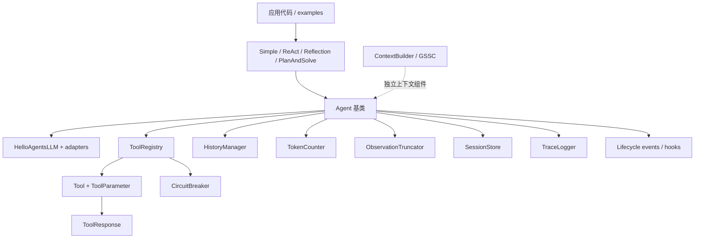
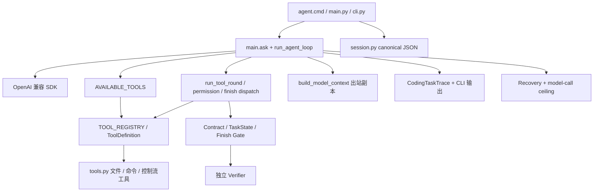

# HelloAgents 与 mini-agent-lab 架构 Gap Analysis

研究日期：2026-09-23。上游仓库：[jjyaoao/HelloAgents](https://github.com/jjyaoao/HelloAgents)，检出 `main` 为 `93e77ea60c13436636c9b39b6761ff8dfe940ba2`，`learn_version` 为 `3927c6d1decb37737c4c1344fde00ccef55ab1f3`。本地参考副本在 `C:\Users\30858\reference\HelloAgents-main` 与 `C:\Users\30858\reference\HelloAgents-learn`，均在本项目之外。当前 mini-agent 以本次工作树为准，含未提交变更。本报告是静态代码审阅，没有运行上游或改动 Runtime。

## 1. HelloAgents 总体架构图

`main` 的主路径是应用显式创建 LLM、注册工具、实例化 Agent，再调用 `run()`。`ReActAgent` 以 `invoke_with_tools()` 使用原生 function calling；工具 schema 在 Agent 基类由注册表构建，模型无 tool call 时通常以文本结束，也有内置 `Finish` 工具。`ContextBuilder` 是独立组件，不能把它误写成每轮 ReAct 请求的默认必经管线。[上游 README](https://github.com/jjyaoao/HelloAgents/blob/main/README.md)、[Agent](https://github.com/jjyaoao/HelloAgents/blob/main/hello_agents/core/agent.py)、[ReActAgent](https://github.com/jjyaoao/HelloAgents/blob/main/hello_agents/agents/react_agent.py)。

`learn_version` 更接近教学拆解：薄 `Agent` 基类、文本格式 ReAct（`Thought/Action/Finish`）、`ToolRegistry.get_tools_description()` 注入提示词；另有 `FunctionCallAgent` 走原生 schema。其 `Tool.run()` 返回字符串，暂无 `main` 的 ToolResponse、SessionStore、TraceLogger 等工程化层。不能把两个分支的能力合并算成一条运行路径。[学习版 Agent](https://github.com/jjyaoao/HelloAgents/blob/learn_version/hello_agents/core/agent.py)、[学习版 ReAct](https://github.com/jjyaoao/HelloAgents/blob/learn_version/hello_agents/agents/react_agent.py)、[学习版 FunctionCallAgent](https://github.com/jjyaoao/HelloAgents/blob/learn_version/hello_agents/agents/function_call_agent.py)。

## 2. mini-agent 当前总体架构图

这里是一个针对本地编码任务的单一 Agent loop，不是通用多 Agent 框架。`main.py` 交互入口和 `cli.py` 单任务 JSON 入口共用工具与核心循环；`agent.cmd` 调本地 venv。持久化只在交互入口显式启用，不能由“支持保存”推断所有入口都在保存。[main.py](../main.py)、[cli.py](../cli.py)、[session.py](../session.py)、[tools.py](../tools.py)、[README](../README.md)。

## 3. 一一对应表

| HelloAgents → mini-agent | 当前差异 | 是否值得借鉴 |
| --- | --- | --- |
| `Agent` / `ReActAgent` loop → `run_agent_loop()` | 上游面向多种 Agent，基类持有 LLM、历史、工具和可选组件；本项目是函数式单 loop，并有 Coding Contract 的确定性收口。 | **B**：保持单 loop；仅在实际出现第二种 Agent 运行范式时再抽基类。 |
| `ToolRegistry` / `ToolParameter` → `TOOL_REGISTRY` / `ToolDefinition` | 上游可动态注册对象与函数、自动展开，并从参数元数据生成 schema；本项目静态注册但 schema、handler、风险、权限元数据同源。 | **B**：当前规模静态表更直接；可借鉴“描述从同一来源生成”，避免 system prompt 手写清单漂移。 |
| `ToolResponse` → 字符串 tool result | 上游有 `success/partial/error`、`text/data/error/stats/context`；本项目给模型字符串，运行时靠失败前缀、命令退出码解析和分类。 | **C**：若未来出现多种机器消费者或部分成功，考虑最小结构化内部结果；当前不宜全量复制字段。 |
| `ReadTool/WriteTool/EditTool/MultiEditTool` → `read_file/write_file/apply_patch/list_files/search_text` | 上游支持备份、mtime 乐观锁、批量编辑；本项目限定 workspace、精确唯一替换、受控命令和审批。 | **B/C**：保留现有边界；只有并发编辑冲突成为真实问题时借鉴乐观锁，不引入批量编辑和备份负担。 |
| `SessionStore` → `session.py` | 上游保存 Agent 配置、历史、工具 schema hash、read cache、统计并做一致性检查；本项目保存 canonical OpenAI 消息、模型、可选 Contract/TaskState，校验 tool call 配对、ID/版本并原子落盘。 | **B**：本项目会话完整性更贴合当前协议；工具或配置恢复发生真实漂移时再借鉴 schema 一致性提示。 |
| `HistoryManager` → `messages` 列表 | 上游集中追加、轮次摘要压缩；本项目 canonical 历史保留原文。 | **B**：保留原始证据适合编码任务；不宜直接把摘要写回唯一历史。 |
| `TokenCounter` → `ask()` 的服务商 usage / 估算缺失 | 上游 tiktoken 本地估算、缓存、增量统计；本项目记录响应 usage，但没有请求前 token 预算门。 | **C**：上下文溢出或成本问题实测出现时做模型适配的预算预检；不要假定上游估算对所有兼容模型精确。 |
| `ContextBuilder` / `ObservationTruncator` → `build_model_context()` / `limit_result_length()` | 上游独立 GSSC 文本选择器与按行/字节截断、完整输出落盘；本项目保留消息协议及 tool-call 配对，仅压缩出站旧工具轮，工具输出按字符截断。 | **B/C**：保留协议安全的出站视图；有截断后必须复取的证据时可借鉴完整输出引用，但 GSSC 不宜直接替换消息链。 |
| `TraceLogger` → `CodingTaskTrace` / 控制台 Trace | 上游 JSONL + HTML 持久事件与统计、脱敏；本项目任务内存事件、摘要供 CLI/eval 使用。 | **C**：只有需要跨进程排查真实运行时再加持久事件；先定义字段与脱敏边界。 |
| `Lifecycle` events/hooks → loop 状态及 Trace 事件 | 上游有异步事件流与 `ExecutionContext`；本项目无通用 hook，但有 Contract/TaskState/审批/收口状态。 | **B**：目前没有插件订阅者，不必抽通用生命周期框架。 |
| `CircuitBreaker` → `Recovery` / 重复调用防护 | 上游按工具连续错误 3 次熔断，300 秒后恢复；本项目按任务阶段和进展停止无效延续、拦重复成功调用。 | **B**：两者处理的问题不同；文件参数错误不应熔断整个工具，暂不照搬。 |
| 多 Agent variants → 单一编码 Agent | 上游 Simple、ReAct、Reflection、PlanAndSolve；学习版还展示 FunctionCall/ToolAware。 | **B**：需要任务证据才引入新运行范式。 |
| PyPI 包 + 示例 → `agent.cmd` / `main.py` / `cli.py` | 上游库式安装、嵌入式 API；本项目面向本地 CLI 和可评测 JSON 任务。 | **B**：现有启动路径符合用途；可借鉴简短端到端示例。 |

上游代码链接：[registry](https://github.com/jjyaoao/HelloAgents/blob/main/hello_agents/tools/registry.py)、[response](https://github.com/jjyaoao/HelloAgents/blob/main/hello_agents/tools/response.py)、[file tools](https://github.com/jjyaoao/HelloAgents/blob/main/hello_agents/tools/builtin/file_tools.py)、[session store](https://github.com/jjyaoao/HelloAgents/blob/main/hello_agents/core/session_store.py)、[history](https://github.com/jjyaoao/HelloAgents/blob/main/hello_agents/context/history.py)、[token counter](https://github.com/jjyaoao/HelloAgents/blob/main/hello_agents/context/token_counter.py)、[builder](https://github.com/jjyaoao/HelloAgents/blob/main/hello_agents/context/builder.py)、[truncator](https://github.com/jjyaoao/HelloAgents/blob/main/hello_agents/context/truncator.py)、[trace](https://github.com/jjyaoao/HelloAgents/blob/main/hello_agents/observability/trace_logger.py)、[lifecycle](https://github.com/jjyaoao/HelloAgents/blob/main/hello_agents/core/lifecycle.py)。

## 4. 近期问题逐项检查

1. **Agent 如何知道 Tool / metadata。** `learn_version` 的 ReAct 把 `get_tools_description()` 放入 prompt；FunctionCallAgent 同时注入描述和 schema。`main` 的 ReAct 从注册表构建 function schemas，内置工具另行并入。mini-agent 的 `AVAILABLE_TOOLS` 来自 `TOOL_REGISTRY` 并传给每次 `ask()`；`SYSTEM_PROMPT` 仍手写工具名和策略。两边都解决了“可调用工具是什么”，但 schema 不表达“此刻是否获批/会话是否激活”。[上游基类](https://github.com/jjyaoao/HelloAgents/blob/main/hello_agents/core/agent.py)、[本地](../main.py)。
2. **Session Persistence。** 上游 `SessionStore` 原子替换、可列举/删除、配置和工具 schema 一致性检查，保存 read cache；本地 `save_session()` 使用临时文件、`fsync`、替换，并验证 canonical tool-call 邻接/配对。上游读缓存和 mtime 绑定其 EditTool；本项目没有对应需求。[上游](https://github.com/jjyaoao/HelloAgents/blob/main/hello_agents/core/session_store.py)、[本地](../session.py)。
3. **Context Management。** 上游 `HistoryManager` 会以摘要替换旧历史，TokenCounter 做本地估数，ObservationTruncator 可把完整大输出另存文件。`ContextBuilder` 作为独立文本管线存在，不是本次观察的 ReAct function-calling 主路径。本地 `OFF/WRITE_ONLY/FULL` 压缩仅作用出站副本，保留原始 Session 与 tool-call 配对；缺请求前硬 token 预算。[上游](https://github.com/jjyaoao/HelloAgents/blob/main/hello_agents/context/history.py)、[本地](../main.py)。
4. **Tool result 和错误。** 上游 ToolResponse 给内部消费者状态与错误码，但 Agent `_execute_tool_call()` 最终又转为带前缀的字符串回喂模型。本地也回喂字符串，但没有统一内部 `status/code/data`，Trace 与重复调用逻辑需要识别文本前缀和命令输出。上游 `ToolResponse.error()` 不接受 `data` 参数，而 `EditTool` 的非唯一匹配路径传入了 `data={"matches": ...}`；该路径可能抛 `TypeError`，不能将上游协议视作无瑕疵实现。[上游 response](https://github.com/jjyaoao/HelloAgents/blob/main/hello_agents/tools/response.py)、[上游 EditTool](https://github.com/jjyaoao/HelloAgents/blob/main/hello_agents/tools/builtin/file_tools.py)、[本地](../main.py)。
5. **Agent completion。** 上游 ReAct 无 tool call 时直接结束，内置 `Finish` 也可结束；它们不是 artifact 验证门。本项目普通聊天无 tool call 结束，Coding Task 必须显式 `finish_task` 经 Contract/TaskState/Finish Gate，结束后另有独立 Verifier。此处本项目设计更严格，不宜回退。[上游 ReAct](https://github.com/jjyaoao/HelloAgents/blob/main/hello_agents/agents/react_agent.py)、[本地](../acceptance.py)。
6. **Recovery / retry / circuit breaker。** 上游确有 `CircuitBreaker`，但 `Agent._execute_tool_call()` 对对象工具直接调用 `tool.run_with_timing()`，只有函数工具走 `ToolRegistry.execute_tool()`，所以默认熔断器不能假定覆盖所有工具。未发现 ReAct 的通用自动重试闭环；LLM 失败路径记录并退出。本地的 Recovery 是第 8 轮附近针对 Coding Task 测试失败/验证/收口的有限状态继续，不是工具熔断器。[上游 registry](https://github.com/jjyaoao/HelloAgents/blob/main/hello_agents/tools/registry.py)、[上游 Agent](https://github.com/jjyaoao/HelloAgents/blob/main/hello_agents/core/agent.py)、[本地](../recovery.py)。
7. **CLI / 启动。** 上游 README 以 `pip install hello-agents` 后 Python API 使用为主；本项目 `agent.cmd` 启动交互 `main.py`，`cli.py --task` 输出 JSON，支持 `--resume`。产品入口不同，无需因为参考项目是库而改成库。[上游 README](https://github.com/jjyaoao/HelloAgents/blob/main/README.md)、[本地 README](../README.md)。

## 5. 能力分类

### A. HelloAgents 已有且在对应用途上更成熟

- 面向**多 Agent/多工具的可扩展性**：动态注册、参数元数据生成 schema、可展开工具、Agent variants。成熟是就“作为可嵌入框架”而言，本项目尚无相同需求。
- **可机读的工具执行状态**：`ToolResponse` 区分成功、部分成功、失败和错误码，支持统计与数据载荷。其在当前 ReAct 主路径会被转回文本，借鉴应落在本项目内部判定可靠性。
- **长运行的诊断材料**：持久 JSONL/HTML Trace、工具耗时和错误统计。对跨进程排障有价值，但本项目当前 eval 已能使用内存 Trace。

### B. mini-agent 已有合理实现，不必照搬

- 单一 OpenAI function-calling loop；tool schema/handler/risk 同源；工作目录边界、审批和受控命令。
- canonical Session 的消息协议校验与原子持久化；保留原文并仅压缩出站上下文。
- Coding Contract、显式 Finish Gate、验证新鲜度和独立 Verifier；这是上游普通 Agent completion 不覆盖的任务契约。
- 针对实际观察到的重复调用与测试失败的有限 Recovery；不能用通用熔断器替代。
- 交互 CLI 与单任务 JSON 入口，适合当前使用和评测方式。

### C. mini-agent 当前缺失、未来值得考虑

- 请求前的上下文预算估算和接近窗口时的明确处理；先以模型上下文溢出或成本数据作为触发条件。
- 工具内部最小结构化结果（至少 `status/code/text`），仅当文本前缀解析导致真实误判或新消费者出现时引入。
- 对持久化 Trace 的可选导出；先明确事件字段、脱敏及产物保留周期。
- 恢复 Session 时的工具 schema/配置漂移提示；当工具集开始动态变化时再做。

## 6. Runtime Capability Introspection 是否真的需要？

**结论：不能从 HelloAgents 推导出“必须新增 `inspect_capabilities`”；也不能说 ToolRegistry metadata 已覆盖 mini-agent 想回答的全部问题。**

上游 `ToolRegistry` 的名称/描述/参数和生成的 tool schema 足够让模型选择工具；学习版还把描述注入 prompt。它们是**静态能力发现**。没有看到上游向模型提供一个同等的实时运行状态清单，包含审批模式、交互审批通道、Contract/TaskState、Session 当前入口激活情况、Verifier 是否配置等。上游熔断状态可由 registry 查询，但默认 schema/描述并不会实时反映每次熔断。[上游 registry](https://github.com/jjyaoao/HelloAgents/blob/main/hello_agents/tools/registry.py)、[上游 Agent](https://github.com/jjyaoao/HelloAgents/blob/main/hello_agents/core/agent.py)。

本项目当前工作树**已经有** `inspect_capabilities`：`capabilities.py` 从注册表和传入的 loop context 构造 `callable_tools` 与 `runtime_features`，并在 schema 和 system prompt 中公开。它回答的重点是“目前能否调用、为什么不能”和运行时功能状态；注册表 schema 本身只能说明“提供了什么接口”。因此本轮不建议继续设计新的 introspection 层或扩展字段。先用既有 eval 核对回答能力问题时是否真的改善准确率、是否把静态清单误当当前可用性，以及无 Session 的 `cli.py` 入口是否准确显示状态。如果改善不明显，优先考虑让 system prompt 的工具清单由注册表生成，或把关键限制写在相关 schema 中；不要为了架构对称新增工具。[本地 capabilities](../capabilities.py)、[本地 tools](../tools.py)、[本地 main](../main.py)。

## 7. 未来最值得借鉴的方向（按价值排序）

1. **让模型可见的工具说明从注册表派生。** 本项目已有单一 `ToolDefinition`，但 system prompt 仍列工具名。解决漂移即可，不需要上游完整动态注册体系。
2. **建立实测驱动的上下文预算。** 在真实溢出或 token 成本数据出现后，参考 TokenCounter 的预算思想；保留本项目 canonical history 与 tool-call 成组压缩。
3. **把“工具执行是否成功”从文本解析逐步移到内部字段。** 若 Trace、Finish Gate 或 retry 判定出现误判，采用最小 `status/code/text`，模型侧仍可接收可读文本。
4. **增加可选、脱敏的持久 Trace 导出。** 仅用于需跨进程复盘的任务；先复用现有 `CodingTaskTrace.events`，不复制 HTML 渲染器。
5. **恢复会话时识别工具契约漂移。** 工具/配置开始频繁变化时借鉴上游 schema hash 检查；当前静态工具表无需急做。

以上均为研究方向，不是实施排期。没有依据表明应照搬多 Agent variants、通用生命周期 hook、批量编辑、全量 ToolResponse 字段或默认工具熔断。
