# Phase 24.3 — Stage-Aware Recovery Semantics Study

Scope: design, current-source analysis, and provider-free replay only. Baseline: `26e5567`. This phase changes no Runtime, prompt, Finish Gate, or real task. `phase24_3.py` models a candidate policy; it does not demonstrate how a live model would behave.

## Deterministic facts and minimum stages

The normal Coding Task limit is eight completed model replies (`config.py`, `main.py:run_agent_loop`). The Phase 24.1 FAIL grace is decided only after turn 8's completed Tool Round and currently allows calls 9–11. `FINISHED` is checked before the limit. `run_tool_round` executes tool calls through the first control-flow call and records a tool result for every included call. A model reply can contain more than one ordinary tool call, so the unit of budget is a **model reply**, not a tool call.

`TaskState` already records actual workspace mutation sequence, last successful exact required-test sequence, and finish status. `recovery_grace_limit` can identify an executed exact required-test failure from the current result, including parsed nonzero exit and no timeout. The latest failed-test fact is **not persisted** in `TaskState`; an implementation must carry it in the recovery controller (and persist it only if recovery can resume across processes). A successful test is fresh when its sequence exceeds the last actual mutation sequence. The Finish Gate also checks allowed paths and runtime error; a fresh PASS is therefore necessary for this recovery path but does not promise Gate acceptance or artifact correctness.

| Stage | Entry evidence | Next useful action |
| --- | --- | --- |
| `REPAIR_NEEDED` | Turn 8 executed exact required test FAIL; or the latest executed exact verification after a repair FAILed. | Actual workspace mutation. |
| `VERIFY_NEEDED` | Actual workspace mutation after the failure; no executed fresh exact required-test PASS after that mutation. | Execute exact required test. |
| `FINISH_NEEDED` | Executed exact required-test PASS after the last mutation, with no subsequent mutation or newer FAIL in this recovery flow. | Call `finish_task`; only the existing Gate can accept. |
| `FINISHED` | Gate accepted `finish_task`. | Terminal. |
| `STOPPED` | A recovery quota or absolute ceiling is reached before acceptance. | Terminal `LIMIT_REACHED`. |

For the smallest candidate, FAIL recovery starts only on the existing turn-8 exact-test FAIL trigger. The current fresh-PASS boundary path still gets its one call to finish. Ordinary tasks with no qualifying boundary observation retain the eight-call behavior. The stage model is budget state, not a second acceptance gate. A later exact FAIL has priority over an older cached PASS when classifying the recovery stage. The present Finish Gate does not itself invalidate a cached PASS on a later FAIL without a mutation; that edge remains a Gate limitation, not something the budget policy should silently redefine.

```mermaid
stateDiagram-v2
    [*] --> REPAIR_NEEDED: turn 8 exact required test FAIL
    REPAIR_NEEDED --> VERIFY_NEEDED: actual mutation
    VERIFY_NEEDED --> REPAIR_NEEDED: exact required test FAIL
    VERIFY_NEEDED --> FINISH_NEEDED: fresh exact required test PASS
    FINISH_NEEDED --> VERIFY_NEEDED: further actual mutation
    FINISH_NEEDED --> FINISHED: finish_task accepted by Gate
    REPAIR_NEEDED --> REPAIR_NEEDED: read / search / rejected premature finish
    VERIFY_NEEDED --> VERIFY_NEEDED: read / search / rejected premature finish
    FINISH_NEEDED --> STOPPED: finish_task rejected; finish quota spent
    REPAIR_NEEDED --> STOPPED: quota or hard ceiling
    VERIFY_NEEDED --> STOPPED: quota or hard ceiling
    FINISH_NEEDED --> STOPPED: hard ceiling
```

Within one model reply, inspect included tool results **in execution order**, update mutation/test facts from actual execution, then decide the stage after the complete Tool Round. An accepted finish wins before budget stopping. A denied, duplicate-blocked, timed-out, malformed, non-exact, or unknown-exit test cannot count as verification. A successful-looking patch without a changed workspace snapshot cannot count as repair. A further actual mutation invalidates the earlier fresh PASS for stage purposes. Read/search does not change stage.

## Bounded opportunity candidate

Use **8 normal calls + at most 7 recovery calls = 15 total model calls** for a turn-8 FAIL. The seven-call envelope is derived from the two observed repair/verification cycles (four useful calls), one final finish attempt, and at most two nonprogress calls. It is a study candidate, not an empirically optimized token cap.

| Opportunity | Rule |
| --- | --- |
| Repair | At most **2 actual mutation replies** in recovery. A second repair may follow a failed verification. Further mutation before testing still consumes this quota. If verification FAILs after repair 2, stop. |
| Verification | At most **2 executed exact required-test replies after a mutation**. Each FAIL returns to `REPAIR_NEEDED`; a PASS moves to `FINISH_NEEDED`. A test attempted while `REPAIR_NEEDED` is nonprogress, not a verified repair cycle. |
| Finish | At most **1 Gate-evaluated `finish_task` attempt while `FINISH_NEEDED`**. Acceptance ends immediately. Rejection spends that opportunity and stops; its reasons should be retained. |
| Detour | At most **2 nonprogress replies** in FAIL recovery: read/search, duplicate/policy/tool failure, no-tool answer, or premature rejected finish. They consume model calls and the detour quota but no repair/verification/finish opportunity. The third detour stops. |
| Absolute ceiling | Stop before scheduling call 16. No stage transition renews this ceiling or any quota. If the last permitted reply is a PASS, mutation, or rejection, preserve its result and stop. |

These quotas reserve enough room for `repair → verify → finish`, one failed verification followed by `repair → verify → finish`, or those paths with up to two detours, provided each useful action arrives before its quota is exhausted. They guarantee **bounded chances**, not a model's choice to take them, a passing test, or Gate acceptance. A token ceiling is not added in this study; measured Phase 24.2 recovery was roughly 19–20k tokens for three calls, so seven calls could materially raise cost. A later implementation may need a separate token policy after measurement.

An early rejected finish in `REPAIR_NEEDED` or `VERIFY_NEEDED` stays in that stage, spends one model call and one detour, and does not consume the one legitimate finish opportunity. This reproduces Run 1's gate behavior without automatic finish. A rejected finish in `FINISH_NEEDED` spends the legitimate finish opportunity and stops, including when the Gate rejects for unexpected files or runtime error. It would be unsafe to assume a second identical call helps; allowing a new repair after a Gate rejection would require a separate, evidence-backed rule. The Finish Gate itself remains unchanged.

Observation replies never grant new calls. A read/search after entering recovery consumes the fixed envelope and detour quota. This prevents observation loops from refreshing budget. Unsuccessful repair or verification attempts likewise consume a model call and detour; the controller should classify actual state changes, not tool names alone.

## Phase 24.2 trace replay

The script reads `phase24_2_results.json` and classifies the saved turn 9–11 tool actions. Every saved recovery turn has one tool action. The script's stage after turn 11 is a **counterfactual policy replay**; the real Runtime stopped at 11.

| Real run | Saved action sequence after turn-8 FAIL | Stage under candidate after turn 11 | Meaning |
| --- | --- | --- | --- |
| 1 | edit → premature finish rejected → exact PASS | `FINISH_NEEDED` | One detour spent; call 12 would be a bounded finish opportunity. The actual artifact passed, but the actual interaction did not complete. |
| 2 | edit → exact FAIL → second edit | `VERIFY_NEEDED` | Repair quota is now 2/2; call 12 can verify. If that test FAILs, stop; if it PASSes, one finish opportunity remains. The saved final artifact check failed, so a hypothetical PASS must not be reported as observed. |
| 3 | edit → exact PASS → finish accepted | `FINISHED` | Closes at call 11, as in the real run. |

## Offline simulation

Run `python eval/phase24_3.py`. Cases use preclassified deterministic events. `TEST_PASS` represents an executed fresh exact required-test PASS; `EDIT` represents an actual mutation; finish outcomes are supplied as Gate results. The script does not execute tools, run the required test, or call a Provider.

| Case | Scripted continuation after boundary | Result |
| --- | --- | --- |
| A | FAIL → edit → PASS → accepted finish | `FINISHED`, call 11 |
| B | FAIL → edit → premature rejected finish → PASS → accepted finish | `FINISHED`, call 12 |
| C | FAIL → edit → FAIL → second edit → PASS → accepted finish | `FINISHED`, call 13 |
| D | FAIL → edit → FAIL → edit → FAIL | `LIMIT_REACHED`, call 12, because both repair cycles are spent; no extra finish call |
| E | FAIL → read → edit → PASS → accepted finish | `FINISHED`, call 12 |
| F | Fresh PASS at normal boundary → rejected finish | `LIMIT_REACHED`, call 9; one finish opportunity spent |
| G | Ordinary task with no recovery trigger | `LIMIT_REACHED`, call 8; normal semantics unchanged |

The replay asserts the three real-run stages and the seven scripted outcomes. These are policy consistency checks only. In particular, the Case C scripted PASS does not contradict the real Run 2 artifact failure.

## Candidate comparison

| Design | Closure reliability against observed traces | Token cost | Implementation complexity | Deterministic testability | Hard-stop safety |
| --- | --- | --- | --- | --- | --- |
| A. Current fixed 3-call FAIL grace | Real closure 1/3. Run 1 ends after PASS; Run 2 after second edit. | Observed 19,625–19,943 recovery tokens/run. | Already implemented. | Straightforward. | 11 total calls. |
| B. Fixed 4/5-call grace | Four calls could allow Run 1 finish; five could allow Run 2 verify then finish **if** repair passes. It still can end after another observation and does not classify ordering. | Extra call(s) on every FAIL continuation that uses them. | Constant change. | Straightforward. | Fixed cap 12/13 calls. |
| C. Stage-aware bounded recovery | Directly identifies Run 1 as needing finish and Run 2 as needing verification. Offers one more repair/verification cycle and limited detours; still no guarantee of model behavior or passing artifact. | Variable, at most seven recovery calls; potentially substantially higher than observed three-call cost. | Moderate: deterministic stage and counters, per-round classification, resume accounting. | High with event scripts and Runtime unit tests; no LLM Judge. | Explicit 15-call ceiling plus per-action and detour quotas. |

## Minimal Runtime candidate for a later phase

Keep the existing turn-8 FAIL and fresh-PASS trigger and the existing Finish Gate. Only for FAIL recovery, replace the fixed `final_limit=11` decision with a task-local recovery budget containing stage, repair/verification/finish counts, detour count, and absolute call ceiling. Derive stage from actual workspace mutation, executed exact-test result and event order, and Gate outcome after each completed Tool Round. Check `FINISHED` first, then quotas/ceiling, before requesting another model reply. Preserve canonical assistant/tool pairs and saved observations. If interrupted recovery is a supported path, persist the latest failed-test fact and counters with TaskState; do not reconstruct them from the stale successful-test sequence alone. Unit-test multi-tool replies and boundary calls before any live evaluation.

Defer an LLM Judge, automatic finish, a new acceptance condition, stage-specific prompt rewrites, unbounded renewal after each FAIL/PASS/read, adaptive token pricing, and more than two repair cycles. The three saved traces justify a small bounded controller study, not a general recovery planner.
